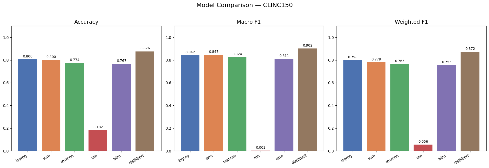
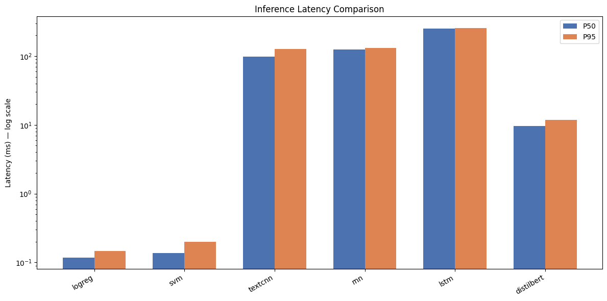
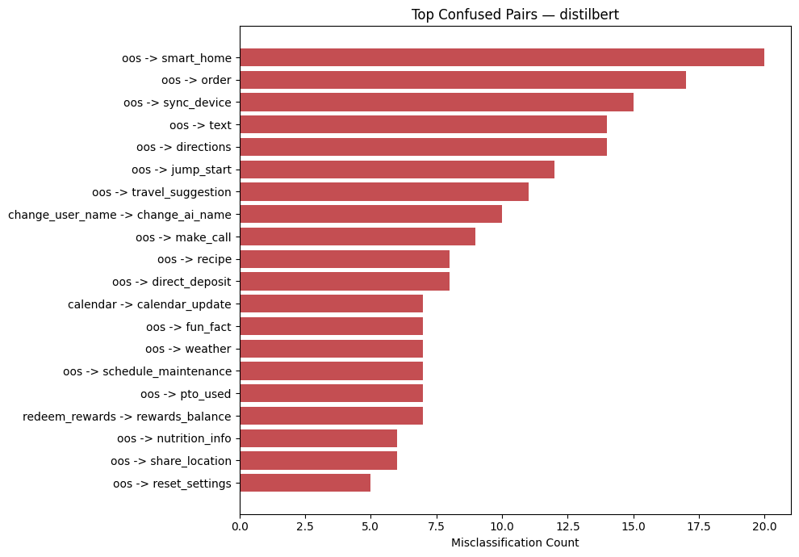
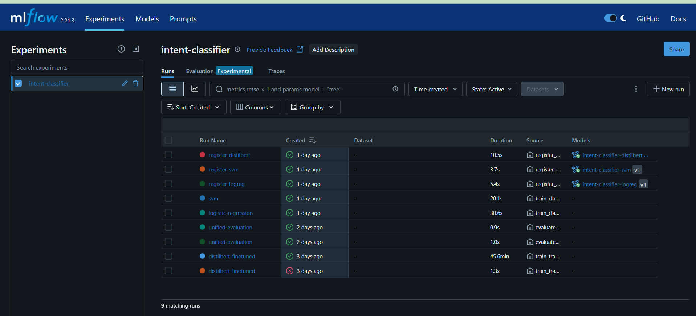
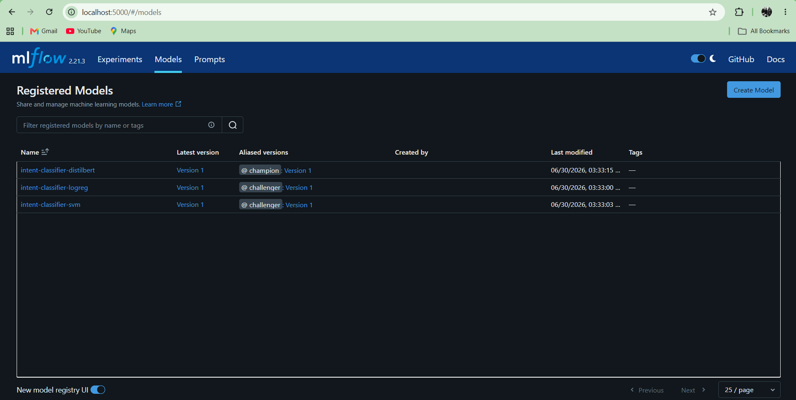
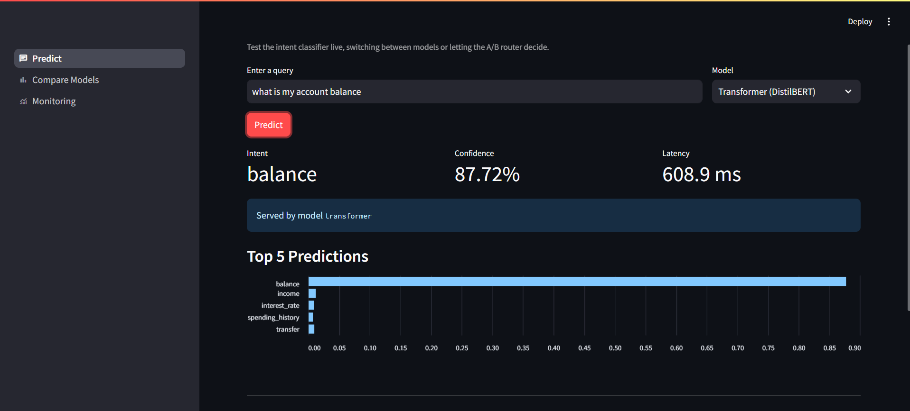
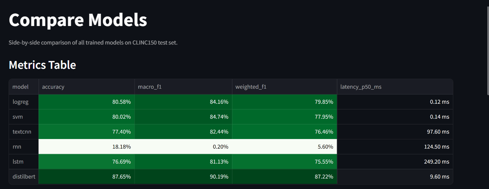
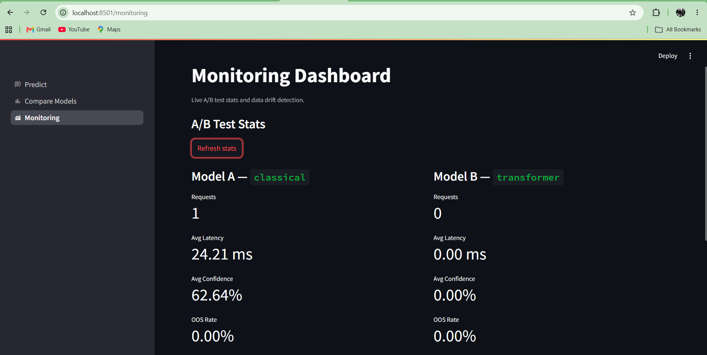

# Intent Classifier

An end-to-end intent classification system built to demonstrate the full ML and MLOps lifecycle — from raw data to a production-ready serving layer with monitoring and CI/CD.

The system classifies user queries into 151 intent categories using the [CLINC150](https://huggingface.co/datasets/clinc/clinc_oos) dataset and compares 6 model architectures across accuracy, F1, and inference latency.

---

## Live Demo

| Service | URL |
|---|---|
| Streamlit App | `http://localhost:8501` |
| FastAPI Docs | `http://localhost:8000/docs` |
| MLflow UI | `http://localhost:5000` |

---

## Architecture

```
CLINC150 Dataset
      │
      ▼
Data Pipeline ──────────────── label_map.json
      │
      ├──► TF-IDF Features ──► LogisticRegression ──► MLflow + S3
      │                    └──► SVM               ──► MLflow + S3
      │
      ├──► Embeddings ─────► TextCNN   ──► MLflow + S3
      │                  ├──► RNN      ──► MLflow + S3
      │                  └──► LSTM     ──► MLflow + S3
      │
      └──► DistilBERT ──────► Fine-tune ──► MLflow + S3
                                               │
                                       MLflow Registry
                                     (@champion / @challenger)
                                               │
                                          FastAPI
                                        /         \
                               A/B Router        Predictor
                                        \         /
                                        Streamlit UI
                                               │
                                        Evidently AI
                                       (Drift Monitoring)
```

---

## Model Results

| Model | Accuracy | Macro F1 | Weighted F1 | Latency P50 |
|---|---|---|---|---|
| Logistic Regression | 80.58% | 84.16% | 79.85% | 0.12ms |
| SVM | 80.02% | 84.74% | 77.95% | 0.14ms |
| TextCNN | 77.40% | 82.44% | 76.46% | 97.6ms |
| RNN | 18.18% | 0.20% | 5.60% | 124.5ms |
| LSTM | 76.69% | 81.13% | 75.55% | 249.2ms |
| **DistilBERT** | **87.65%** | **90.19%** | **87.22%** | **9.6ms** |

> Evaluated on CLINC150 test set (5,500 samples including 1,000 out-of-scope queries)

### Model Comparison



### Inference Latency (log scale)



---

## Key Findings

**RNN completely failed (18% accuracy)** — Vanilla RNN suffers from vanishing gradients on 151-class classification. Gradient clipping had no effect. This is a fundamental architectural limitation, not a bug.

**LSTM needed 45 epochs to converge** — With patience=3 the LSTM was cut off at epoch 20 while still climbing. Increasing patience to 5 and epochs to 50 fixed it, raising accuracy from 64% to 77%.

**Classical ML beats neural networks on short text** — Average query length is 40 characters. TF-IDF captures word presence very effectively at this scale. TextCNN and LSTM only surpass LogReg with pretrained embeddings (DistilBERT).

**OOS detection is the primary challenge** — Across all models, the dominant error pattern is OOS queries being misclassified into real intents. The 150 in-scope classes are well-separated. The real modeling challenge is confidence-based rejection.

### Top Confused Pairs — DistilBERT



### OOS Detection

The `is_oos` flag is triggered when model confidence falls below `OOS_THRESHOLD` (default 0.5). Classical models flag more queries as OOS due to lower confidence even on correct predictions — a deliberate latency vs confidence tradeoff surfaced by the A/B router.

---

## MLOps Pipeline

### Experiment Tracking — MLflow

Every training run logs:
- Hyperparameters (from YAML config)
- Per-epoch metrics (loss, accuracy, F1)
- Confusion matrix and classification report as artifacts
- Model artifacts (registered to MLflow Model Registry)



### Model Registry

Models are registered with aliases instead of deprecated stages:

```
intent-classifier-distilbert   @champion    Version 1
intent-classifier-logreg       @challenger  Version 1
intent-classifier-svm          @challenger  Version 1
```



### Artifact Storage — AWS S3

All trained models and vectorizers are versioned in S3:

```
s3://intent-classifier145/
├── classical/
│   ├── logreg.pkl
│   ├── svm.pkl
│   └── tfidf.pkl
├── neural/
│   ├── textcnn.pt
│   ├── rnn.pt
│   ├── lstm.pt
│   └── vocab.pkl
└── transformer/
    └── distilbert/
        ├── config.json
        ├── model.safetensors
        └── tokenizer/
```

### A/B Testing

Traffic is split between two models via a configurable router:

```
Request ──► ABRouter (split=0.3)
              ├── 70% ──► Model A (classical)   avg confidence: 57%
              └── 30% ──► Model B (transformer) avg confidence: 89%
```

Configure via `.env`:
```
AB_MODEL_A=classical
AB_MODEL_B=transformer
AB_SPLIT=0.3
```

Stats are live on the Monitoring dashboard.

### Drift Monitoring — Evidently AI

Detects three types of drift in production traffic:

| Signal | Threshold | Action |
|---|---|---|
| Confidence drop | > 10% | Flag degradation |
| OOS rate increase | > 15% | Flag topic drift |
| Data drift (text length) | Kolmogorov-Smirnov | Flag distribution shift |

---

## Streamlit Frontend

### Predict Page

Live intent prediction with model selector, confidence bar chart, OOS flag, and A/B variant info.



### Compare Models Page

Color-graded metrics table, bar charts for accuracy/F1/latency, and a live side-by-side prediction tool.



### Monitoring Dashboard

Live A/B stats and drift detection report.



---

## Stack

| Layer | Tools |
|---|---|
| Language | Python 3.10 |
| Package Manager | uv |
| Data | HuggingFace Datasets (CLINC150) |
| Classical ML | scikit-learn |
| Deep Learning | PyTorch |
| Transformers | HuggingFace Transformers |
| Experiment Tracking | MLflow |
| Artifact Storage | AWS S3 |
| Monitoring | Evidently AI |
| API | FastAPI |
| Frontend | Streamlit |
| Containers | Docker + docker-compose |
| CI/CD | GitHub Actions |

---

## Project Structure

```
intent-classifier/
├── configs/              # YAML hyperparameter configs per model
├── src/
│   ├── data/             # CLINC150 loading and preprocessing
│   ├── features/         # TF-IDF vectorizer
│   ├── models/           # Classical, neural, transformer model classes
│   ├── training/         # Training scripts for all 5 model types
│   ├── evaluation/       # Unified evaluation and comparison
│   ├── serving/          # Predictor abstraction and A/B router
│   ├── monitoring/       # Evidently drift detection
│   ├── storage/          # AWS S3 upload/download
│   └── utils/            # Config loader, MLflow utils, settings
├── api/                  # FastAPI routes and schemas
├── app/                  # Streamlit frontend (3 pages)
├── scripts/              # CI helper scripts
├── tests/                # pytest test suite (72 tests)
├── notebooks/            # EDA and training notebooks
├── Dockerfile
├── docker-compose.yml
└── pyproject.toml
```

---

## Setup

```bash
git clone https://github.com/princ0301/intent-classifier
cd intent-classifier
pip install uv
uv sync
cp .env.example .env
```

Fill in `.env` with your AWS credentials and MLflow URI.

---

## Train Models

```bash
# classical baseline
uv run python src/training/train_classical.py

# neural networks (TextCNN, RNN, LSTM — all 3 in one run)
uv run python src/training/train_neural.py

# DistilBERT fine-tuning (GPU recommended)
uv run python src/training/train_transformer.py

# register best models to MLflow registry
uv run python src/training/register_models.py
```

---

## Run

**Start MLflow** (separate terminal):
```bash
uv run mlflow server --host 0.0.0.0 --port 5000
```

**Start API**:
```bash
uv run uvicorn api.main:app --reload --port 8000
```

**Start Streamlit**:
```bash
uv run streamlit run app/streamlit_app.py
```

---

## Run with Docker

```bash
docker-compose up --build
```

Services start automatically:
- FastAPI: `http://localhost:8000`
- Streamlit: `http://localhost:8501`
- MLflow: `http://localhost:5000`

---

## Tests

```bash
uv run pytest tests/ -v
```

```
tests/test_data.py         12 tests   data pipeline
tests/test_features.py      9 tests   TF-IDF features
tests/test_models.py       16 tests   model architectures
tests/test_serving.py      15 tests   predictor + A/B router
tests/test_monitoring.py   10 tests   drift detection
tests/test_api.py          11 tests   FastAPI endpoints
─────────────────────────────────────────────────────
Total                      72 tests   all passing
```

---

## CI/CD

GitHub Actions runs on every push to `main`:

```
lint              ruff check + format check
test-unit         data, features, models, monitoring tests (no artifacts needed)
test-integration  downloads classical models from S3, runs serving tests
```

Train workflow is available as a manual trigger (`workflow_dispatch`) to retrain any model from the GitHub Actions UI.

---
